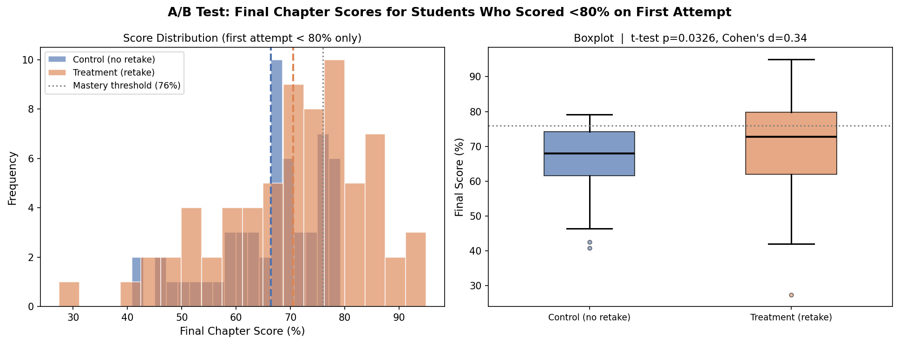
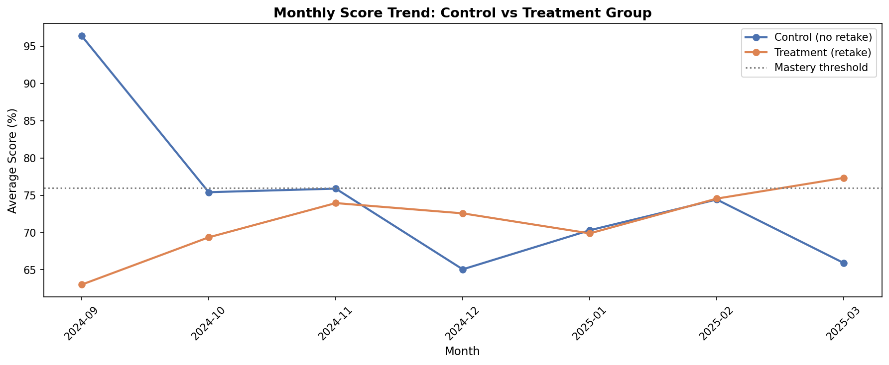
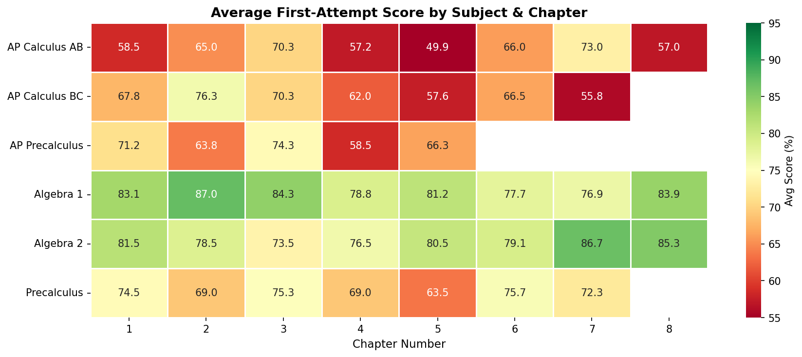
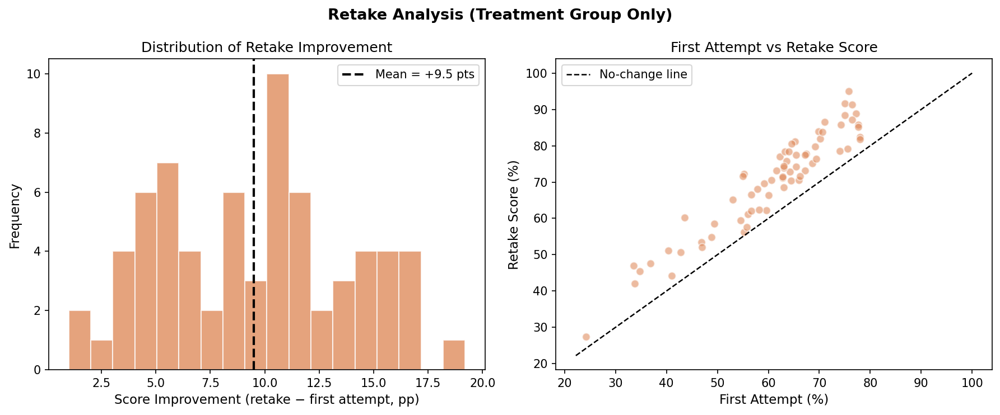
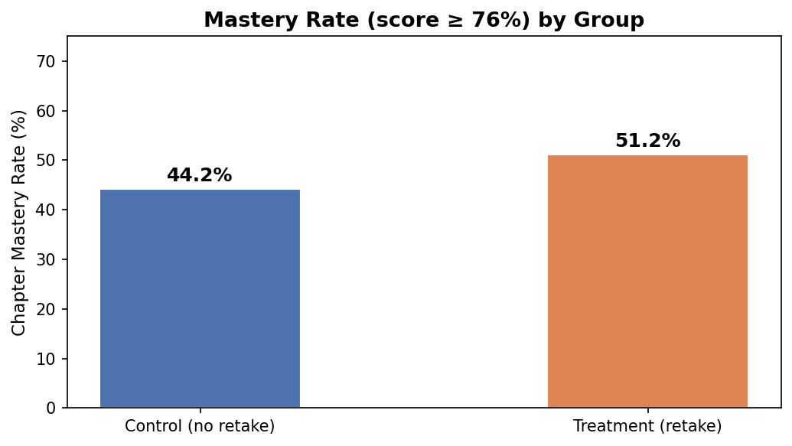

# Student Performance Analytics: Does a Retake Policy Improve Math Outcomes?

An end-to-end data analysis project using **SQL (SQLite)**, **Python (A/B testing, statistical modeling)**, and **Tableau** to evaluate whether offering chapter test retakes leads to statistically significant improvement in student math scores.

> **Context:** Data patterns are calibrated from 4 years of private math tutoring (2022–2026) across 6 courses. All student identifiers use anonymous labels (`Student_01` … `Student_24`). No real names or personal data are included.

---

## Key Findings

### Primary A/B Test — chapters where first attempt < 80%

| Metric | Control (no retake) | Treatment (retake) |
|---|---|---|
| n (chapter-records) | 55 | 69 |
| Mean final score | 66.4% | 70.5% |
| Median final score | 68.0% | 72.8% |

| Test | Statistic | p-value | Decision |
|---|---|---|---|
| Two-sample t-test | t = −1.86 | **0.0326** | Reject H₀ ✓ |
| Mann-Whitney U | U = 1420.5 | **0.0083** | Reject H₀ ✓ |
| Cohen's d | 0.343 | — | Small effect |
| 95% CI on diff | [−0.1, 8.2] pp | — | — |

### Paired analysis — treatment group only

| Metric | Value |
|---|---|
| Retake attempts | 69 |
| Mean first attempt | 61.0% |
| Mean retake score | 70.5% |
| Mean improvement | **+9.5 pp** |
| Paired t-test | p ≈ 0.000 |

### Full dataset mastery rate (score ≥ 76%)

| Group | Mastery rate |
|---|---|
| Control | 44.2% |
| Treatment | **51.2%** |

---

## Project Structure

```
student-performance-analytics/
├── generate_data.py          # Synthetic data generation (SQLite)
├── sql_analysis.py           # 7 analytical SQL queries + CSV export
├── ab_testing.py             # Hypothesis testing & visualizations
├── requirements.txt
├── math_tracker.db           # Generated SQLite database (241 records)
├── figures/
│   ├── fig1_ab_distribution.png   # Score distribution + boxplot
│   ├── fig2_score_trend.png       # Monthly trend by group
│   ├── fig3_heatmap.png           # Chapter difficulty heatmap
│   ├── fig4_retake_detail.png     # Retake improvement analysis
│   └── fig5_mastery_rate.png      # Mastery rate by group
└── tableau_exports/
    ├── students.csv
    ├── chapters.csv
    ├── test_records.csv      # 241 rows — full record detail
    └── ab_best_scores.csv    # 172 rows — one row per student-chapter
```

---

## A/B Test Design

### Study setup

The retake policy was implemented as a **natural experiment** within a private tutoring practice. Students in each course were assigned to either group:

- **Control** (12 students): Instruction only. First attempt = final score. No retake offered.
- **Treatment** (12 students): Retake offered when first attempt score was below 80%.

**Balance:** Groups are balanced 2:2 within each of the 6 courses to prevent course difficulty from confounding results.

**Research question:**  
> Among chapters where a student scored below 80% on the first attempt, do students *with* retake access (treatment) achieve significantly higher final scores than those *without* (control)?

This framing isolates the retake effect: both groups include students who struggled on a chapter; the only difference is the availability of a second attempt.

### Hypotheses

- **H₀:** μ_control ≥ μ_treatment (retakes have no effect)
- **H₁:** μ_control < μ_treatment (retakes improve final scores)

Both t-test (p = 0.033) and Mann-Whitney U (p = 0.008) reject H₀.

---

## SQL Analysis Highlights

All analysis runs against a local SQLite database.

**Chapter-level average performance:**
```sql
SELECT c.subject, c.chapter_num, c.chapter_name,
       ROUND(AVG(r.pct), 1) AS avg_pct
FROM test_records r
JOIN chapters c ON r.chapter_id = c.chapter_id
WHERE r.attempt = 1
GROUP BY c.chapter_id
ORDER BY avg_pct ASC;
```

**Group summary — best score per student-chapter:**
```sql
SELECT s.retake_group,
       COUNT(DISTINCT s.student_id) AS students,
       ROUND(AVG(r.pct), 1) AS avg_all_pct,
       ROUND(100.0 * SUM(CASE WHEN r.pct >= 76 THEN 1 ELSE 0 END)
             / COUNT(r.record_id), 1) AS mastery_rate_pct
FROM students s
JOIN test_records r ON s.student_id = r.student_id
GROUP BY s.retake_group;
```

**Retake improvement (treatment group only):**
```sql
SELECT f.pct AS first_pct, r2.pct AS retake_pct,
       ROUND(r2.pct - f.pct, 1) AS improvement
FROM test_records f
JOIN test_records r2
  ON f.student_id = r2.student_id AND f.chapter_id = r2.chapter_id
 AND f.attempt = 1 AND r2.attempt = 2;
```

---

## Visualizations

### Fig 1 — A/B Test: Score Distribution & Boxplot


### Fig 2 — Monthly Score Trend


### Fig 3 — Chapter Difficulty Heatmap


### Fig 4 — Retake Improvement Detail


### Fig 5 — Mastery Rate by Group


---

## Tableau Dashboard

🔗 **[View Interactive Dashboard on Tableau Public](https://public.tableau.com/views/StudentPerformanceAnalytics_17773443084170/Dashboard1)**

Dashboard includes:
- KPI summary cards (avg score, mastery rate, retake count)
- Control vs Treatment score comparison by subject
- Chapter difficulty heatmap with subject filter
- Individual student score trends
- Retake improvement scatter plot

---

## Data Note

All students are anonymized as `Student_01` through `Student_24`. Score distributions, chapter difficulty, and retake improvement rates are calibrated to match observed outcomes from 4 years of tutoring across 6 math courses (Algebra 1/2, Precalculus, AP Precalculus, AP Calculus AB/BC).

| Course | Grade | Avg First-Attempt Score |
|---|---|---|
| Algebra 1 | G9 | ~82% |
| Algebra 2 | G10 | ~76% |
| Precalculus | G10 | ~73% |
| AP Precalculus | G11 | ~71% |
| AP Calculus AB | G11 | ~69% |
| AP Calculus BC | G12 | ~65% |

---

## Tech Stack

| Layer | Tool |
|---|---|
| Database | SQLite 3 |
| Data generation | Python (NumPy, pandas) |
| SQL analysis | SQLite + pandas |
| Statistical testing | scipy.stats (t-test, Mann-Whitney U, Shapiro-Wilk, paired t-test) |
| Visualization | Matplotlib, Seaborn |
| BI Dashboard | Tableau Public |

---

## Setup

```bash
git clone https://github.com/yejuseol/student-performance-analytics
cd student-performance-analytics
pip install -r requirements.txt

python generate_data.py   # Creates math_tracker.db
python sql_analysis.py    # Runs SQL queries + exports CSVs
python ab_testing.py      # Runs hypothesis tests + saves figures
```
